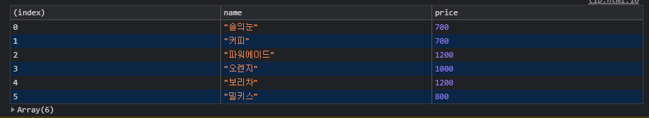
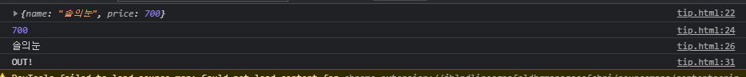
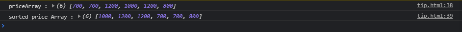
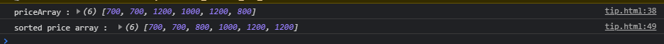
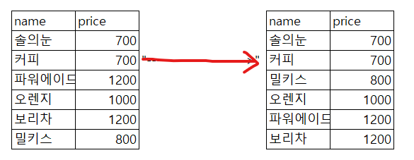
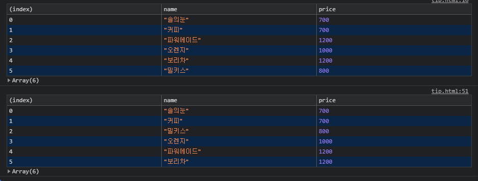

## 자바스크립트 알고리즘 파트를 위한 팁 공유

#### 개요

지난번에 은경님께 간단한 공부방법 공유 이후에 다른 몇몇분들도 javascript <code>function</code> 알고리즘에 대해 바로 바로 이해하시기 어려운 부분이 존재하는 것 같아, 나름의 직관적인 이해를 위한 공부방법 자체를 공유해볼까 합니다.

저는 원래 python(프로그래밍 언어 중 하나)으로 데이터분석을 할 때 처음에 바로바로 이해되지 않는 부분이 너무 많아서 그때마다 다 일일이 `print()`(`=consol.log();`)를 해가면서 공부했었는데요. 그렇게 **눈으로 계산되는 과정자체를 하나하나 분해해서 보니까 나름 이해하기가 수월했습니다.**

혹시나, **저처럼 시각적인 공부법이 맞으신 분들에게는 도움이 될까해서 이렇게 글을 적었습니다.**

<i style="color:red;">(본인의 오감 중 다른 감각의 공부법이 맞으신 분들은 다소 적합하지 않은 공부방법일 수도 있음을 사전에 말씀드립니다)\*</i>

---

#### 사용한 데이터

데이터는 우리가 사용한 교육 중에 강사님께서 예로 주신 음료수 데이터세트를 활용했습니다.

```javascript
var productList = [
    {
        name: "솔의눈",
        price: 700,
    },
    {
        name: "커피",
        price: 700,
    },
    {
        name: "파워에이드",
        price: 1200,
    },
    {
        name: "오렌지",
        price: 1000,
    },
    {
        name: "보리차",
        price: 1200,
    },
    {
        name: "밀키스",
        price: 800,
    },
];
```

그리고 해당 파일을 `drinks.js`라는 파일로 따로 저장하여, html 파일에서 참조해서 사용하였습니다. 사용방법은 아래와 같습니다.

```javascript
현재 켜져있는 html파일이 포함된 디렉토리(폴더) 내에 drinks.js라는 파일을 만듭니다.

그리고 파일을 켜서 안에 위에 적혀있는 데이터를 Copy&Paste합니다.

그리고 html 파일 내에서 <script src ="./drinks.js"></script>
를 사용하여 참조합니다.

```

저처럼 파일을 참조하실 때 간혹 파일명을 잘못치는 경우와 해당 외부 데이터 경로를 이상한 데 저장하는 경우를 사전에 방지하기 위해 바로 `src="drinks.js"`라고 사용하는 것 보다 저처럼 `src="./drinks.js"`라고 지정하는 것이 좋습니다.

```javascript
나쁜 예 : <script src ="drinks.js"></script>
좋은 예 : <script src ="./drinks.js"></script>
```

---

#### console.log();를 활용한 함수 이해방법

우선 데이터 참조까지 다 하셨다면! 데이터가 제대로 참조되었는지 확인하는 습관이 중요합니다.(우리가 사용할 데이터는 엑셀데이터처럼 데이터프레임형식(row와 columne으로 이뤄진 데이터)라서 그냥 table로 확인했습니다!)

```javascript
    <script src="./drinks.js"></script>
    <script>
        console.table(productList);
    </script>
```

-   result
    

**문제.1 : 외부데이터에서 가격데이터만을 가져와서 새로운 배열에 저장하기**
이후, 데이터가 제대로 참조되었다면 for문을 통해 한 데이터씩 진입해서 가격데이터만을 꺼내와 새로운 배열에 저장하는 것을 설명드릴까 합니다. 방법이 여러가지가 있긴 하지만, basic한 for-loop를 활용하겠습니다.

자! for 문을 보여드리기에 앞서 처음 프로그래밍을 접한 분들이라면 for 및 함수 내부가 어떻게 작동되는지 직관적으로 이해하시가 어려울 것 입니다.

```javascript
function 함수명 (파라미터...) {
  코드블록..
}

for (var i = 0; ...) {
  코드블록..
}
```

그렇기 때문에 for이나 function 내부에 내가 작성한 코드가 어떻게 작동되는지 하나하나 눈으로 익히는 것이 좋습니다. `console.log();`로 찍어보면 됩니다. 또한 무리하게 한번에 다 돌리지말고 마지막에 break; 이라는 코드를 활용해 첫 loop만 확인해보는 것도 좋은 방법입니다.(function 내부에서는 사용불가)

```javascript
for (var i = 0; ...) {
  코드블록..


  break;
}
이렇게 되면 for문이 1번 돌아가고 break을 만나 종료되어 for문 밖으로 빠져나옵니다.
```

자 그럼 먼저 음료수리스트(productList)를 참조해 for-loop를 돌면서 한 데이터씩 꺼내보는 걸 한 루프만 돌리고 break해보겠습니다.

```javascript
// 가격데이터를 담을 새로운 배열 오브젝트 선언
let newArray = [];

// 처음에 for문을 돌려야하니 list의 length를 변수로 지정해주고
let len = productList.length;

// for문 내부로 진입
for (let i = 0; i < len; i++) {

    // 첫번째 루프 : 현재 i = 0

    // 첫번째 음료수(productList[0]) 출력
    console.log(productList[i]);

    // 첫번째 음료수의 가격 출력
    console.log(productList[i].price);

    // 첫번째 음료수의 이름 출력
    console.log(productList[i].name);

    // 출력이 다되면 for문 정지
    break;

    // 원래는 i가 1이 더해져서 i = 0 + 1 => i = 1 이 되지만!
    break해버려서 종료되고 아래의 중괄호 밖으로 빠져 나갑니다!
}

// 빠져나가면 OUT 출력
console.log("OUT!");
```

-   result
    

이제 그럼 한바퀴를 돌리되 가격 데이터는 새로운 배열에 넣어보겠습니다.

```javascript
        var newArray = [];

        let len = productList.length;

        for (let i = 0; i < len; i++) {

            console.log(productList[i]);

            console.log(productList[i].price);
            newArray.push(productList[i].price);

            // console.log(productList[i].name);

            break;
        }

        console.log("OUT!");
        console.table("새로운 배열:", newArray);


이렇게 되면 출력이 어떻게 나올까요? 상상해보면
새로운 배열을 생성하고
newArray => []

이제 for문 안에서 첫번째 아이템에 접근해 (productList[0])
다시 첫번째 아이템에서 가격정보로 접근합니다. (prodcutList[0].price)

그리고 그걸 newArray에 push합니다.
그럼 700이 [] 안으로 슝 들어갑니다. [] => [700]
그리고 break을 만나 종료되고, OUT!이 출력되겠죠
```

자 이제 그럼 break을 없애고 다시 그냥 정상적인 for문을 돌려보는 걸 상상해보면 내가 참조한 외부데이터에서 한 아이템씩 접근하고, 그 아이템의 가격정보로 접근해 그 정보를 새로운 배열에 넣는 과정을 외부데이터의 길이(productList.length)만큼 반복합니다.

여기서 하나 추가로 알려드릴 팁은
구조에 관한 것인데요.

우리가 흔히 사용하는 `변수명.속성` 에서 저 `.속성`의 구조는 잘 생각해보면 커다란 오브젝트에서 그 작은 오브젝트로 진입하는 것을 의미합니다.

무슨 말이냐하면

```javascript
var productList = [

    {
        name: "솔의눈",
        price: 700
    },
    {
        name: "커피",
        price: 700
    },
    {
        name: "파워에이드",
        price: 1200
    },
    {
        name: "오렌지",
        price: 1000
    },
    {
        name: "보리차",
        price: 1200
    },
    {
        name: "밀키스",
        price: 800
    }
];

이게 사실은 그냥 아래와 같은 구조이고
var productList = [{0} , {1}, {2}, {3}, {4}];

prductList[i]을 하는 코드는 `변수명.속성`에서
[{0} , {1}, {2}, {3}, {4}] => {0} 을 하는 것가 같다는 말입니다.

같은 의미로

productList[i].price는

prductList[i] = {
  name: "name",
  price: "price"
}

이런 구조에서 또 저 price으로 진입하는 과정이니

{0} = {"name", "price"} => "price"로 접근하는 것과 같다는 말입니다.


그럼 우리가 사용하는 Array.push는 뭘까요?
그것도 저런 구조입니다. Array는 애에서 push라는 오브젝트로 접근!

단, push라는 오브젝트가 함수로 이뤄져있는 것 뿐이죠.

자바스크립트는 만들 때 사람을 본따 만든 언어라서
Array라는 사람의 속성 중 하나가 push라는 행동(함수) 이 있는데,

Array.push는 Array라는 사람보고 push해! 라고 시키는 것과 같은 맥락입니다.

그럼 Array라는 오브젝트 내에는
Array = {
  ...,
  ...,

  push: function pushFunction(item){

  }
}
이렇게 구성되어 있겠죠? (아마도..)
```

그럼 최종적으로 이번 문제인,
**"문제.1 : 외부데이터에서 가격데이터만을 가져와서 새로운 배열에 저장하기"**는 아래와 같은 함수로 만들 수 있습니다.

```javascript
function getPriceArray(arr) {
    var newArray = [];

    let len = productList.length;

    for (let i = 0; i < len; i++) {
        newArray.push(productList[i].price);
        // 제대로 들어가고 있는 지 확인!
        console.log(newArray);
    }

    return newArray;
}

let priceArray = getPriceArray(productList);
// 역시나 항상 결과는 머리로 말고 눈으로 확인합니다.
console.table("새로운 배열:", priceArray);
```

---

**문제.2 : 외부데이터에서 가격데이터만을 가져와서 새로운 배열에 저장 후, sorting하기**

자 그럼 한 스텝 더 나아가서 sort까지 하고 함수로 만들어 보겠습니다. 우선 sort함수에 대해 다시 설명드릴게요.

python에서는 `sort`하면 알아서 숫자도 sort해주는 데 js는 안 그러더군요 ㅠ 모든 인풋 데이터를 문자로 취급해서 해줘서 그런 것 같습니다. 그럼 가격 정보를 그냥 `sort()`하면 어떻게 될까요?
아래와 같습니다.

```javascript
let priceArray = getPriceArray(productList);

console.log("priceArray :", priceArray);
console.log("sorted price Array :", priceArray.sort());
```

-   result
    

맨 앞자리 숫자 순에 맞게 정렬해줍니다. 애매하면 모르면.. 그냥 다 이렇게 찍어서 눈으로 확인하세요 꼭!꼭!꼭!

그래서, 다시 강사님께서 말씀해주신 방법으로 함수를 변형하면 아래와 같습니다.

```javascript
일반적으로 JavaScript에서 true는 1과, false는 0과 같다고 표현되기도 합니다.
(저도 검색하면서 알게 되었습니다.) 쉽게 생각해보면 컴퓨터는 1과0으로 이루어져 있으니,
true(=실행)은 1로 false(=비실행)은 0으로 처리한다는 게 어찌보면 당연한 개념일 수도 있겠네요.

다시 그런 관점에서 아래를 보면 좀 더 이해가 수월합니다.
sort라는 애는 앞 뒤 순서를 바꿔주는 애인데,
어쩔 때 실행(true, 1)하는 지와 어쩔 때 비실행(false, 0)하는 지를 세부적으로 정해주는 것 입니다.

다만, sort에서는 바꿔주는 것(a > b)과 바꾸지 않는 것(a < b)과 넘기는 ( a = b) 일 때가
있으니 1, -1, 1으로 분리된 거 같아요

(* 이건 뇌피셜로 받아드리기 쉽게 설명한 내용입니다)


그럼 함수 내부를 주석처리로 하나 하나 까발린다고 할 때
    var p = priceArray.sort(function (a, b) {
        자 ! 일단 함수 실행됬고

        priceArray = [700, 700, 1200, 1000, 1200, 800]
        에서 첫 번째 a와 b는 700과 700인데

        a = 700
        b = 700

        그럼 if문에서 맨 마지막 0에 해당되는 조건이니까
        return 0을 해주겠네!

        이것도 의심이 된다면
        return 전에 console.log 해보면 됩니다.

        if (a > b) return 1;
        else if (a < b) return -1;
        else return 0;


    });


함수 내부에서 console log까지 확인하는 코드(0에만 걸어뒀습니다)
    var p = priceArray.sort(function (a, b) {
        if (a > b) return 1;
        else if (a < b) return -1;
        else {
            console.log(a, b);
            return 0;
        }

    });


이러면, 결과가
처음에 700 700이라고 출력되요!
```

-   result
    

그리고! 강사님께서 보다 쉽게 만드는 코드가 있다고 하셨으니 그것도 잠시 보자면

```javascript
자 이런 형식인데.. 이번에도 하나하나 까발려볼게요!
    var p = priceArray.sort(function (a, b) {

        자 ! 일단 함수 실행됬고

        priceArray = [700, 700, 1200, 1000, 1200, 800]
        에서 첫 번째 a와 b는 700과 700인데

        a = 700
        b = 700

        a - b 를 return 하면 0을 return 하는 경우니까
        위에 처럼 넘기겠죠!

        나머지 경우에 대해서도 이렇게 계산해보면 이해하실 수 있습니다.

        return a - b;
    });


이것도 궁금하면 아래처럼 찍어서 하나하나 비교해보세요!
    var p = priceArray.sort(function (a, b) {
        console.log(a, b);
        return a - b;
    });
```

자! 그러면 대망의 문제2번 정리인데, **"문제.2 : 외부데이터에서 가격데이터만을 가져와서 새로운 배열에 저장 후, sorting하기"**였으니까 이걸 함수로 처리하면 아래와 같습니다.

```javascript
function getSortedPriceArray(arr) {
    var newArray = [];

    let len = productList.length;

    for (let i = 0; i < len; i++) {
        newArray.push(productList[i].price);
    }
    // return newArray;

    var sortedNewArray = newArray.sort(function (a, b) {
        return a - b;
    });

    return sortedNewArray;
}

let sortedPriceArray = getSortedPriceArray(productList);
console.log("sorted price array : ", sortedPriceArray);
```

---

**문제.3 : 외부데이터 참조해서 가격데이터 기준으로 테이블 sorting하기**

자 그럼 정말 마지막 문제로 이걸 해볼게요! 위에서는 가격 정보를 가지고와서 그걸 새로운 배열에 넣고 그 배열을 정렬했다면! 이번에는 쉽게 엑셀창을 켜서 가격col을 기준으로 정렬하는 기능을 사용했겠구나 생각하시면 됩니다.

-   result
    

코드는 생각보다 엄청 간단한데 보고 바로 이해 안되실까봐
또 하나하나 까볼게요..!

```javascript
var sortedPriceArray = productList.sort(function (a, b) {

      자 함수 내부로 들어오면
      처음에 제가 모라고 했나여

      productList = [{0}, {1}, {2}, {3}]; 라고 했었어요.
      그럼 이제 a와 b는 뭐가 될까요?

      {0}랑 {1} 이거 두 개가 되겠죠!

      a = {0}
      b = {1}

      그럼 다시 아래 return을 하는게
      그냥 a와 b가 아니라 a.price와 b.price니까!

      다시 {0}와 {1} 에서 .price로 하면
      선택된 오브젝트 내에 price란 속성(=오브젝트명)으로 접근하는 거니까!!

      {0}.price = a.price 는

      {0} = {
        name: "솔의눈",
        price: 700
      }
      이 상태에서 => 700으로 접근하는 것이죠.

      그럼 return a.price와 b.price를 비교하는 행위는
      productList = [{0}, {1}, {2}, {3}];
      이 배열에서 {0}라는 오브젝트의 price와 {1}라는 오브젝트의 price를 비교하고 그 결과에 따라

      productList의 [ ... ... ... ] 이 배열 아이템 순서를 정렬하라는 명령입니다.

      이것도 모르겠으면 console.talbe로 찍어보세요!(log가 아닌 table로 하는 이유는 출력되는 값이 value가 아니라 오브젝트 형식으로 나와서 입니다.)

      return a.price - b.price;
  });

```

-   result
    

---

끝으로 시간이 남아서 하는 건 아니고 저도 예전에 공부할 때 정말 못따라갔어서 아쉬운 맘에 적었습니다. 지치네여..

p.s - 모두 화이팅!
